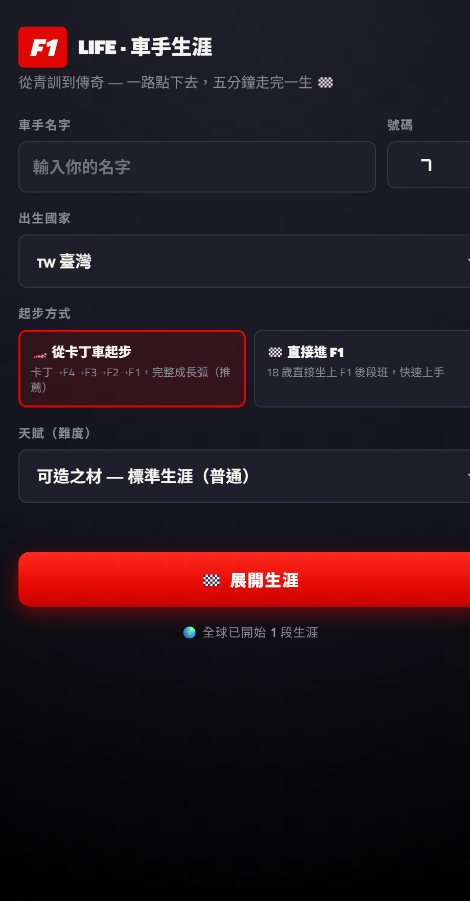
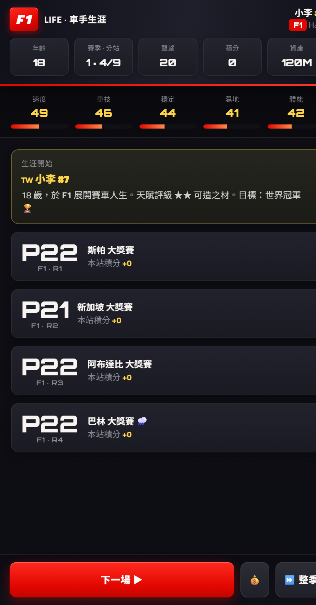
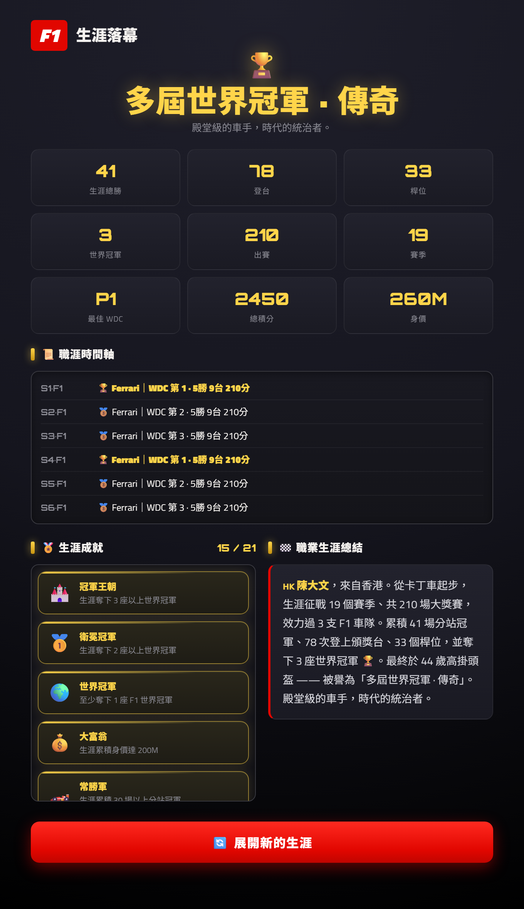

# 🏁 F1 LIFE — 車手生涯（快速版）

> 從青訓到傳奇 —— 一路點下去，**五分鐘走完一整段 F1 車手人生**。

一款純前端、免安裝的 F1 車手生涯模擬遊戲。從卡丁車一路爬上 F1，經歷訓練、比賽、傷病、代言與換隊，多個賽季後光榮退役，看看你能留下什麼樣的傳奇。

---

## 📸 螢幕截圖

| 建立車手 | 賽事進行 | 生涯落幕 |
|:---:|:---:|:---:|
|  |  |  |

---

## ✨ 遊戲特色

- **完整成長弧**：卡丁車 → F4 → F3 → F2 → F1，或直接進入 F1 後段班。
- **現場直播賽事**：一圈一圈跑，名次即時跳動、賽車在賽道上前進、旁邊有即時排名塔。
- **賽中關鍵抉擇**：每季隨機幾站會在關鍵圈數暫停，讓你決定超車、防守、賭雨胎、輪胎管理、引擎模式 —— 當場影響名次。
- **真實車手陣容**：F1 對手採 2026 車隊的真實車手與實力值（Verstappen、Hamilton、Leclerc、Alonso…）。
- **車手屬性系統**：速度、車技、穩定、濕地、體能，隨年齡成長與衰退。
- **💰 資產與投資**：用薪資投資自己（訓練營、模擬器、心理師、雨戰特訓、公關），每次都有失敗風險。
- **🤝 代言合約**：季末簽多年期代言賺資金；合約期間還會有醜聞、活動、獎金、財務危機等動態事件。
- **⚠️ 突發狀況／傷病**：生涯隨機發生，降低評分或讓你缺賽（DNS）。
- **職涯管理**：季末續約或被挖角；連續低迷會被降級或釋出；35 歲後可主動退役，最高 45 歲。
- **🏅 生涯成就**：21 種成就（天才之星、大器晚成、大富翁、G.O.A.T…），退休時結算。
- **🌍 全球遊玩次數**：開始畫面顯示所有玩家累計開始的生涯次數。
- 中文介面、深色賽車風格、**自動存檔**（localStorage）、**響應式排版**（手機/電腦皆可）。

---

## 🎮 玩法

1. 輸入車手名字、號碼、國籍，選擇起步方式與天賦難度，按 **🏁 展開生涯**。
2. 按 **「下一場 ▶」** 逐場比賽（享受直播與賽中抉擇），或 **「⏩ 整季」** 一鍵跳完整季。
3. 用 **「💰 投資」** 把賺到的資產拿去提升能力。
4. 每個賽季結束會結算積分、簽代言、續約/換隊，年齡增長、屬性變化。
5. 一路征戰到退役，查看你的**傳奇評價、生涯成就與職業生涯總結**。

---

## ▶️ 遊玩方式

- **線上遊玩**：`https://<你的-github-帳號>.github.io/<repo-名稱>/`（部署到 GitHub Pages 後填入）
- **本機遊玩**：直接用瀏覽器打開 `index.html` 即可，無需安裝或建置。

---

## 🗂️ 檔案結構

```
.
├── index.html      # 網頁骨架
├── style.css       # 樣式
├── script.js       # 遊戲邏輯
├── screenshots/    # README 用截圖
└── README.md
```

> 專案也提供一份「全部內嵌」的單一 HTML（`F1 Life 快速生涯.html`），內容與資料夾版相同，方便單檔分享。

---

## 🛠️ 技術

- 純 **HTML / CSS / 原生 JavaScript**，零依賴、零建置流程。
- 遊戲進度以 **localStorage** 儲存於瀏覽器（換裝置或清資料會重置）。
- **全球遊玩次數**使用免費計數服務 [Abacus](https://abacus.jasoncameron.dev)（免註冊、支援 CORS）。
  - 命名空間設定在 `script.js`：
    ```js
    const COUNT_NS  = "f1careerlifesim";  // 想避免與他人衝突可改成不好猜的字串
    const COUNT_KEY = "plays";
    ```
  - 計數存在伺服器端，更新遊戲檔案不會重置。

---

## 📄 授權

個人專案，歡迎自由遊玩與修改。車隊與車手名稱僅供娛樂用途，與 Formula 1 官方無關。
